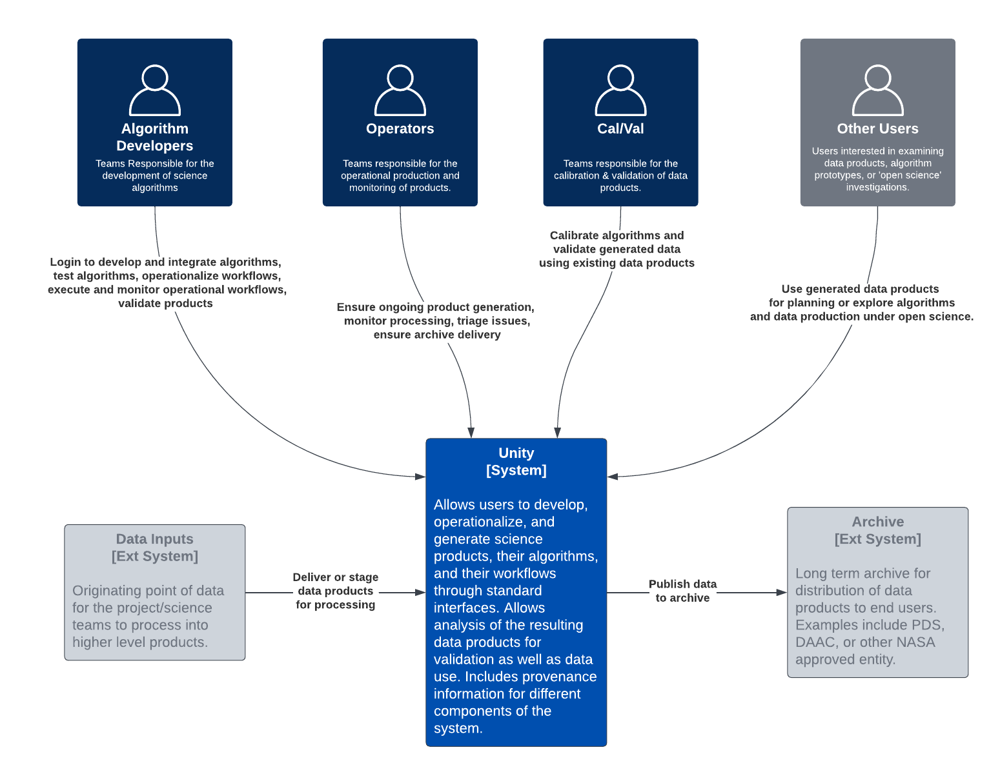
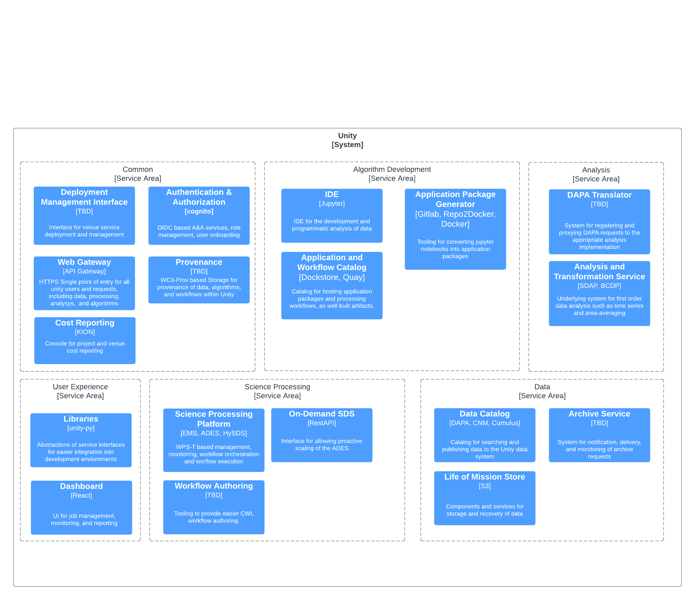

# Architecture

The Unity Architecture follows a [C4](https://c4model.com/) architecture definition style.

### System Context

### Service Areas&#x20;

Service areas are how work and responsibility for foundational services are structured within the Unity system. The high level functionality services are defined as:

* Algorithm Development (ADS)
* Science Processing (SDS)
* Data Services (DS)
* Analysis Services (AS)

there are two others which are more broad in scope, either in how the other service areas operate or how they are all pulled together

* Common Services (CS)
* UIUX(UIUX)

### Containers

Containers are the subsystems within the Unity System. Above we have the demarcated by the service area responsible for their development. Users, however, do not see the 'service' area portion, they see different services, applications, or UIs that usually combine on or more of the above subsystems to accomplish _some end-user goal._
