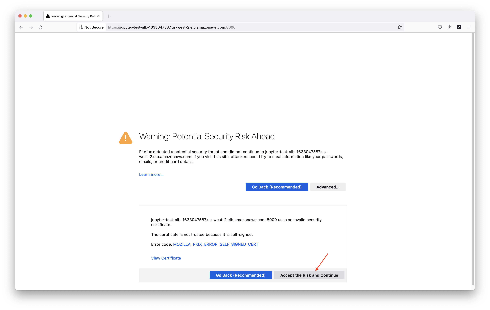
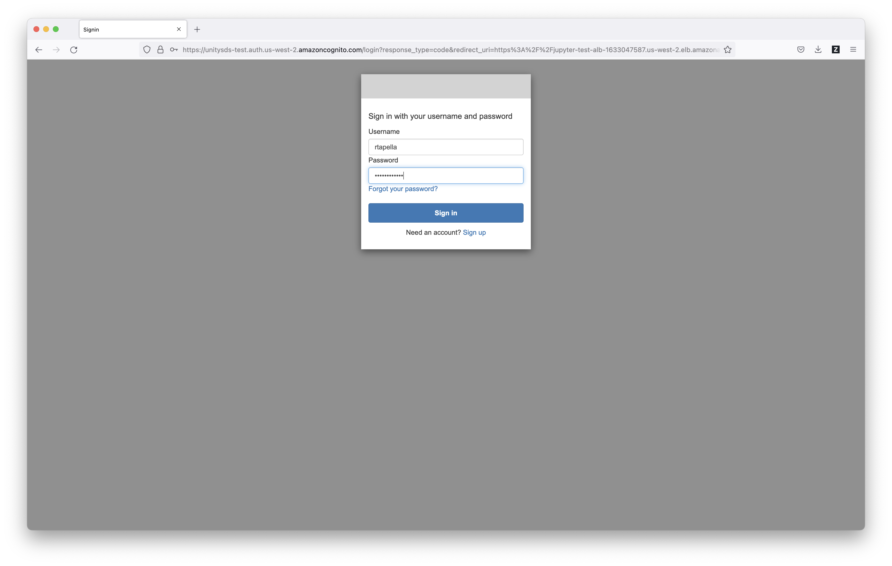
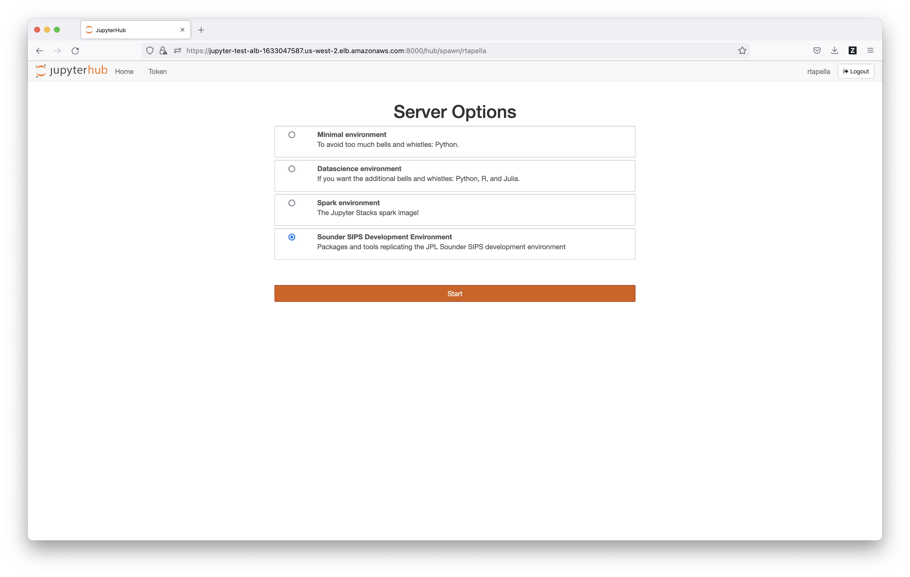
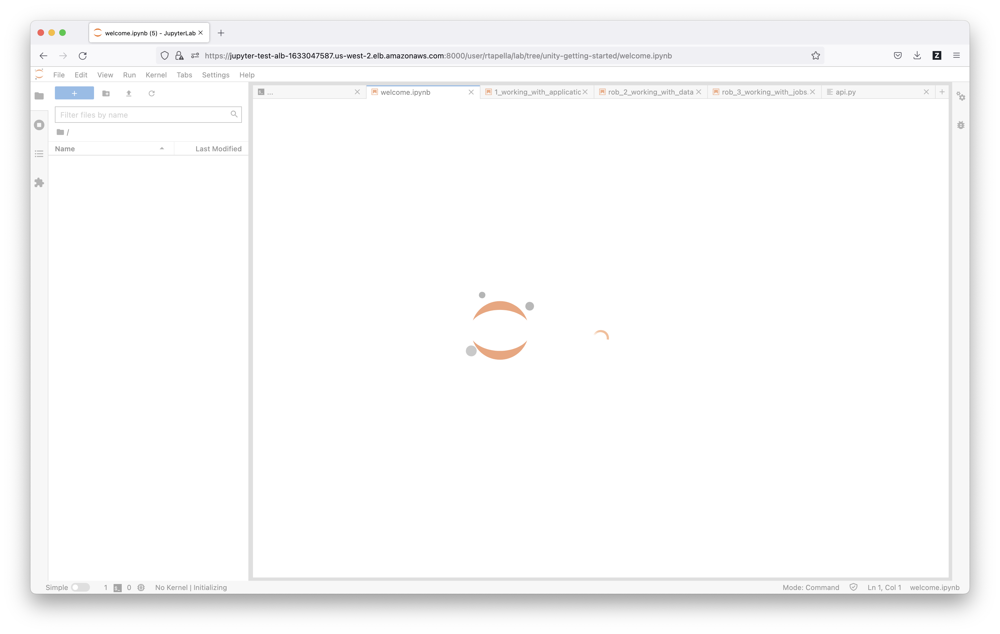

# Unity Account and Login

### Logging in for the first time (test or development systems)

Currently it necessary for a Unity administrator to create a new account for you. Please contact your Unity support team to request an account.

1. When a new account is created you will receive an email with a temporary password. It will come from `no-reply@verificationemail.com`. If you did not receive this email please let the support team know.
2. Go to the Jupyter URL ([https://jupyter-test-alb-1633047587.us-west-2.elb.amazonaws.com:8000/](https://jupyter-test-alb-1633047587.us-west-2.elb.amazonaws.com:8000/)). You will likely see a notice that there is a "security risk". This is because we self-sign the security certificates in the development environment and is expected.  \
   
3. "Accept the Risk" as per your web browser's standard method. Firefox is shown here as an example. On Chrome you will need to click on the text link and then accept.\
   
4. You should see a button that says "Log in with Unity Common Services".  Press the button.\
   .png>)
5. Now you will have the login prompt. Use the username and password that were emailed to you. \
   
6. You should be immediately asked to change your password. Please do so.
7. After you have input your login information, Jupyter will ask you to choose "Server Options". If you choose the Minimal environment it will not have many basic tools installed. We suggest using the Sounder SIPS Development Environment.\
   
8. Once you've chosen the server options, Juypter will load. \
   
